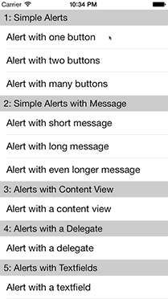

# DLAlertView

**DLAlertView** is an API-compatible **UIAlertView** replacement that can **embed custom content views**, is **fully themable** and let's you use a **delegate** and/or **blocks**.

## Preview


## Features

* **Same API** as **`UIAlertView`** (+ **much, much more**!).
* Use **delegates** and/or **blocks**!
* **Animations** that match UIAlertView in iOS 7.
* **Default look** that matches UIAlertView in iOS 7.
* **Any number** of **buttons** per alert (`1..n`).
* **Any number** of **textfields** per alert (`0..n`).
* Optional **custom content view**.
* **Change** title/message/contentView **while shown**.
* **Add** textfields **while shown**.
* **Add** buttons **while shown**.
* **Apply custom themes** to your individual alerts.
* **Apply** individual **themes** to your individual **textfields**.
* **Apply** individual **themes** to your individual **buttons**.
* **Change** themes of alert/textfields/buttons **while shown**.
* **Crossfade** between **themes**.

## Installation

Just copy the files in `"DLAlertView/Classes/..."` into your project.

Alternatively you can install DLAlertView into your project with [CocoaPods](http://cocoapods.org/).  
Just add it to your Podfile: `pod 'DLAlertView'`

## Usage

See [DLAVAlertView.h](DLAlertView/Classes/DLAVAlertView.h) for the complete API.

### Example usage

```objc
DLAVAlertView *alertView = [[DLAVAlertView alloc] initWithTitle:@"Click OK!" message:nil delegate:nil cancelButtonTitle:@"OK" otherButtonTitles:nil, nil];
		[alertView showWithCompletion:^(DLAVAlertView *alertView, NSInteger buttonIndex) {
			NSLog(@"Clicked button '%@' at index: %ld", [alertView buttonTitleAtIndex:buttonIndex], (long)buttonIndex);
		}];
```

## Demos

**DLAlertView** contains a demo app giving you a quick overview of many of its features.

## ARC

**DLAlertView** uses **automatic reference counting (ARC)**.

## Dependencies

None.

## Requirements.

iOS 5.1+

## Creator

Vincent Esche ([@regexident](http://twitter.com/regexident))

## License

**DLAlertView** is available under a **modified BSD-3 clause license** with the **additional requirement of attribution**. (**DLAlertView** further more includes code by Alexander Jarvis, licensed under the **MIT license**.) See the `LICENSE` file for more info.
